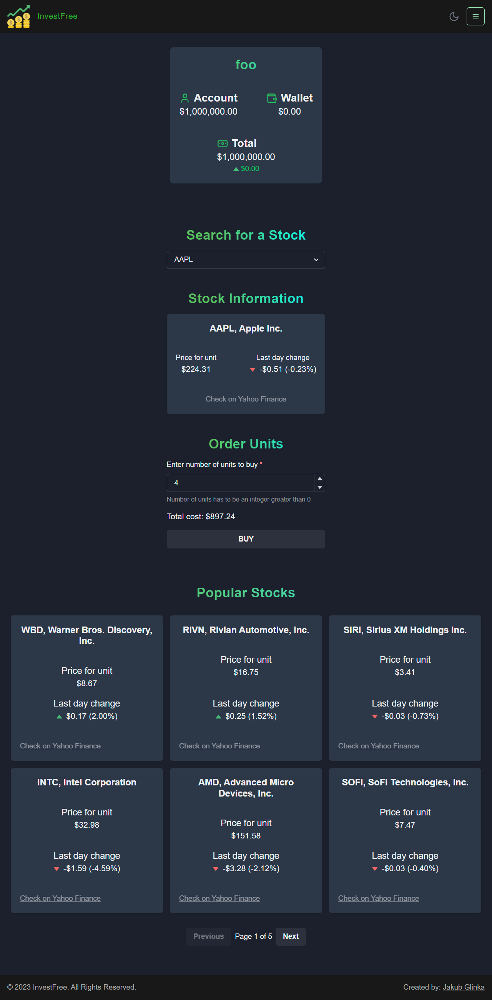

# 💲 InvestFree

## Invest in market stocks for free in a real world simulation

# Overview

This project is a stock investing simulator where you start with $1,000,000 and can buy and sell shares of popular American stocks such as NVDA, TSLA, AMZN, and AAPL. The stock prices are synced with real-time market data. You can track your profit and compare it with others, competing to become the best investor. This web application allows users to practice and improve their investing skills without the risk of losing real money. It's an excellent way for beginners to get familiar with stock investing.

# ⚙️ How to Run?

The steps below provide exemplary commands to achieve certain operations. Keep in mind that the commands might vary slightly depending on your environment/operating system. These commands were tested on Windows using the Git Bash shell. If you are using a different environment, you might need to use slightly different commands.

## Running the Web App Locally

### Download the Repository

1. Download the repository from GitHub and unzip it.

### Run Backend

#### Prerequisites

- Ensure you have [Python](https://www.python.org/) installed.

1. Open a new terminal and navigate to the backend folder located in the root of the project.
2. Create a `.env` file for environment variables in the backend folder.
3. Add the following variables to the `.env` file:

   - `SECRET_KEY`: A random string of characters.
   - `DEBUG=True`
   - `POLYGON_STOCK_API_KEY`: Your API key for stock data, obtainable for free by creating an account on [Polygon](https://polygon.io/).

   Note: You can skip the `POLYGON_STOCK_API_KEY` step since the source code already contains stock data for one day. The application will run, but the data will not be synced with real-world data and won't update.

4. Create a new Python virtual environment: `python -m venv venv`
5. Activate the environment: `source venv/Scripts/activate`
6. Install the necessary packages: `pip install -r requirements.txt`
7. Create database migrations: `python manage.py makemigrations`
8. Apply the migrations: `python manage.py migrate`
9. (Optional) Create a superuser account to access the admin dashboard: `python manage.py createsuperuser`
10. Run the server: `python manage.py runserver`

    If the server is running successfully, you should see a message indicating that "Debug mode is on, skipping stock data fetch." This means the stock data is not being fetched from the API because `DEBUG=True` is set in the `.env` file. To fetch current stock data, set `DEBUG=False` and run the server once to fetch and save new data. Then, you can switch back to `DEBUG=True`.

### Run Frontend

1. Open a new terminal and navigate to the frontend folder.
2. Create a `.env` file for environment variables in the frontend folder.
3. Add the following line to the `.env` file: `VITE_BACKEND_URL=http://127.0.0.1:8000`
4. Install the necessary packages: `npm install`
5. Run the app: `npm run dev`
6. The app should run on `http://127.0.0.1:5173/` or a similar URL.

# Project Specification

## Backend

The backend is a Django project consisting of a single app called investfree. By default, the project uses the SQLite3 database, but it can be easily switched to any other SQL database, such as PostgreSQL.

### Environment Variables

The backend requires the following three environment variables:

- **SECRET_KEY**: A randomly generated string used as the secret key in the backend's `settings.py` file.
- **DEBUG** (True or False): Indicates whether the server should run in Debug mode.
- **POLYGON_STOCK_API_KEY**: An API key for accessing stock data.

  This variable must be set to refresh current stock prices daily. The server calls this API when it starts and every 24 hours.

### Models

The backend has three main models:

- **User**: Keeps track of all registered users.
- **StockOwnership**: Records the number of shares a user owns for a specific stock.
- **Transaction**: A record created every time a user buys or sells shares.

  This model is currently not in use as it would generate a large number of records and cause the database to grow quickly. However, it can be useful for implementing a transaction history for a user. It could, for example, hold only the last 10 transactions for a user, deleting previous ones to prevent the database from growing indefinitely.

## Frontend

The frontend is a React project primarily written in TypeScript. It uses Vite as a build tool and is a Single Page Application (SPA) that communicates with the backend via a REST API. For styling, it mainly uses Tailwind CSS along with some custom CSS. React Router handles routing, and Chakra UI provides styled components, facilitating the creation of both dark and light themes. Icons are sourced from the Lucide library.

### Environment Variables

The frontend requires the following environment variable:

- **VITE_BACKEND_URL**: The URL of the backend server.

  This variable is used to make requests to the backend server and is set in the `.env` file.

### Project Structure

- **public folder**: Contains image assets.
- **src/pages**: Contains all the pages used in the app.
- **src/components**: Contains all the components used in the app.
- **src/hooks**: Contains all the custom hooks used in the app.
- **src/utils**: Contains all the utility functions used in the app.
- **src/types**: Contains all the types used in the app.

# 🖼️ Project Screenshots

## Home

## Dashboard

## Empty Wallet

## Wallet

## Register

## Login

## Rankings

## Account

# 🎥 Short video presenting project

https://youtu.be/AsjBw201-Ck
